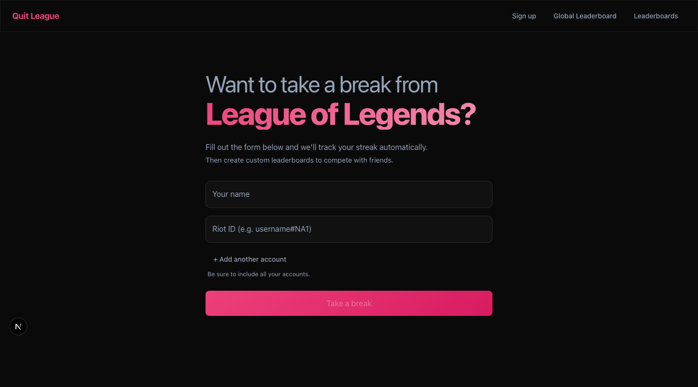
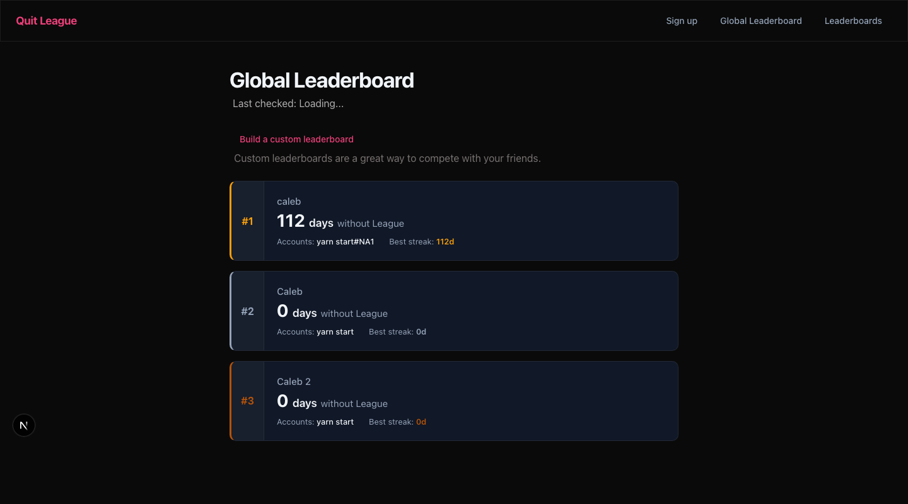
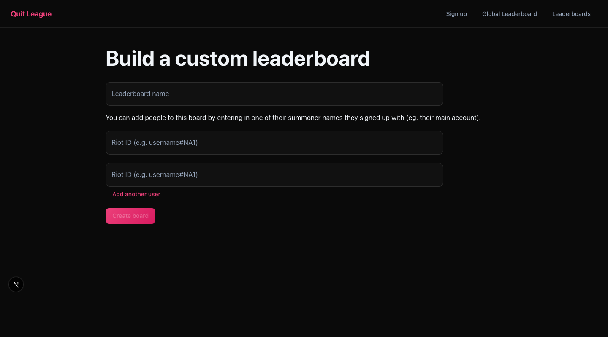

# Quit League Helper

A web app that automatically tracks how long you've gone without playing League of Legends — and lets you compete with friends on custom leaderboards.



## What it does

Sign up with your name and Riot ID(s) and the app will check your match history every 12 hours via the Riot Games API. Your streak resets the day you play a game. You can link multiple accounts so smurfing doesn't save you.

Once you're signed up you can create a named leaderboard, add your friends, and see who's holding out the longest.



## Features

- **Automatic streak tracking** — a GitHub Actions cron job hits the match history API every 12 hours and updates every player's streak
- **Global leaderboard** — ranked view of all players with gold/silver/bronze badges for the top 3
- **Custom leaderboards** — create a named board and add any signed-up players to compete against your friends specifically
- **Multi-account support** — link all your accounts so your streak is based on your most recently played one
- **Admin panel** — manually trigger a match history check or reset check times at `/admin`



## Tech stack

- [Next.js 15](https://nextjs.org/) (Pages Router)
- [React 18](https://react.dev/)
- [MUI v5](https://mui.com/) with Emotion
- [Prisma 5](https://www.prisma.io/) + PostgreSQL
- [Riot Games API](https://developer.riotgames.com/) (account-v1, match-v5)
- Deployed on [Vercel](https://vercel.com/)

## Getting started

### Prerequisites

- Node.js 20+
- PostgreSQL database
- [Riot Games API key](https://developer.riotgames.com/) (dev keys expire every 24h)

### Setup

```bash
# Install dependencies
npm install

# Copy env file and fill in your values
cp .env.example .env

# Run database migrations
npx prisma migrate deploy

# Start the dev server
npm run dev
```

### Environment variables

```env
DATABASE_URL=postgresql://...
LEAGUE_API_KEY=RGAPI-your-key-here
```

## How the streak check works

1. A GitHub Actions cron job runs every 12 hours and calls `/api/check-user-matchhistory`
2. The API finds all users whose `lastModifiedTime` is older than 24 hours
3. For each user it fetches their PUUID via the Riot `account-v1` endpoint using their Riot ID (`username#TAG`)
4. It then fetches their recent match list from `match-v5` and looks at the timestamp of the most recent game
5. The streak is calculated as the number of full days since that game

If the Riot API returns a 403/401, your API key needs to be regenerated. You can trigger a manual check from `/admin`.

## Cron job

GitHub Actions runs a check every 12 hours:

```yaml
on:
  schedule:
    - cron: "0 1,13 * * *"
```

You can also trigger it manually from the `/admin` page.
